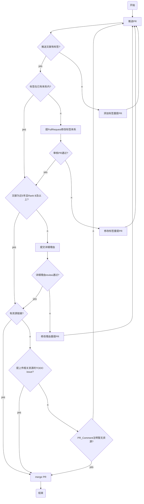

# 论文收集流程图

```mermaid
flowchart TD
	start(开始)
    op1[推送PR]
    cond_a{推送文献有标签?}
    cond_b{标签在已有体系内?}
    cond_c1{文献为近5年且Rank B及以上?}
    op2[提交详细理由]
    cond_c2{详细理由review通过?}
    cond_d{有资源链接?}
    op3[merge PR]
    exit(结束)

    op_e1[添加标签重提PR]
    op_e2__op_1[提PullRequest修改标签体系]
    cond_e2__cond_a{审核PR通过?}
    op_e2__op_2[修改标签重提PR]
    op_e3[修改理由重提PR]
    cond_e4__cond_a{提上传相关资源的TODO issue?}
    cond_e4__cond_b{PR_Comment注明暂无资源?}


    start --> op1 --> cond_a --yes--> cond_b --yes--> cond_c1 --yes--> cond_d --yes--> op3 --> exit
    
    cond_a --no--> op_e1 --> op1
    cond_b --no--> op_e2__op_1 --> cond_e2__cond_a
    cond_e2__cond_a --yes--> cond_c1
    cond_e2__cond_a --no--> op_e2__op_2 --> op1
    cond_c1 --no--> op2 --> cond_c2
    cond_c2 --yes--> cond_d
    cond_c2 --no--> op_e3 --> op1
    cond_d --no--> cond_e4__cond_a
    cond_e4__cond_a --yes--> op3
    cond_e4__cond_a --no--> cond_e4__cond_b
    cond_e4__cond_b --yes--> op3
    cond_e4__cond_b --no--> op1
   
```