# OpenResearch

Curated research papers, articles, and blogs on every aspect about free and open source software (FOSS) ecosystem. 🔎

Table of Contents

# Topics

|No. | Paper                                                                                                                                                                                                        | Author | Conf&Journal | Year | Rank | [Tags](./MindMap/Topic.md) |
|---|--------------------------------------------------------------------------------------------------------------------------------------------------------------------------------------------------------------|---|---|---|---|---|
|T1| [What Makes a Great Maintainer of Open Source Projects?](https://ieeexplore.ieee.org/abstract/document/9402023)[[LocalLink](./PDF/What%20Makes%20a%20Great%20Maintainer%20of%20Open%20Source%20Projects.pdf)] |Edson Dias et al.|ICSE|2021|A|`A.a.2.开发者`|
|T2| How Do Companies Collaborate in Open Source Ecosystems? An Empirical Study of OpenStack[[LocalLink](./PDF/How_Do_Companies_Collaborate_in_Open_Source_Ecosystems_An_Empirical_Study_of_OpenStack.pdf)]       |Yuxia Zhang et al.|ICSE|2020|A|`A.b.3.企业`,`D.社区与生态`|
|T3| Sustainability Forecasting for Apache Incubator Projects[[LocalLink](./PDF/Sustainability%20Forecasting%20for%20Apache%20Incubator%20Projects.pdf)]                                                          |Likang Yin et al.|FSE|2021|A|`D.d.1.Sustainability`|
|T4| Let's Talk About It: Evaluating Contributions through Discussion in GitHub[[LocalLink](./PDF/Let's%20Talk%20About%20It-%20Evaluating%20Contributions%20through%20Discussion%20in%20GitHub.pdf)]              |Jason Tsay et al.|FSE|2014|A|`C.e.1.Contributions`|
|T5| **Companies' Participation** in OSS  Development-An Empirical Study of OpenStack                                                                                                                             |Zhang,  Y., Zhou, M., Mockus, A., & Jin, Z.|TSE|2021|A|`A.b.3.企业`,`D.社区与生态`|
|T6| **World of  code**: enabling a research workflow for mining and  analyzing the universe of open source VCS data                                                                                              |Ma, Y., Dey,  T., Bogart, C., Amreen, S., Valiev, M., Tutko, A., ... & Mockus, A|ESE|2021|A|`E.a.5.VCS`|
|T7| Profiles of **Schema  Evolution** in Free Open Source Software Projects                                                                                                                                      |Vassiliadis, P|ICDE|2021|A|`D.f.演化`|
|T8| CENTRIS: A precise and  scalable approach for identifying modified **open-source  software reuse**                                                                                                           |Woo, S., Park,  S., Kim, S., Lee, H., & Oh, H|ICSE|2021|A|`B.a.1.Code Reuse`|
|T9| Understanding **Community Smells** Variability: A  Statistical Approach                                                                                                                                      |Catolino, G.,  Palomba, F., Tamburri, D. A., & Serebrenik, A|ICSE|2021|A|`D.b.6.Community Smells`|
|T10| Representation  of **Developer Expertise** in  Open Source Software                                                                                                                                          |Dey, T.,  Karnauch, A., & Mockus, A|ICSE|2021|A|`A.a.2.开发者/Developer Expertise`|
|T11| Enterprise-Driven  Open Source Software: A Case Study on **Security Automation**                                                                                                                             |Angermeir, F.,  Voggenreiter, M., Moyón, F., & Mendez, D|ICSE|2021|A|`C.h.1.CI`|
|**T12**| The **Shifting** Sands of **Motivation**: Revisiting What Drives Contributors in Open Source[[Video](https://www.bilibili.com/video/BV14U4y1c7TE?p=2)]                                                       |Gerosa, M.,  Wiese, I., Trinkenreich, B., Link, G., Robles, G., Treude, C., ... &  Sarma, A|ICSE|2021|A|`A.a.2开发者/Motivation Changes`|
|T13| **Secure  software development** in the era of fluid multi-party open software and  services                                                                                                                 |Pashchenko,  I., Scandariato, R., Sabetta, A., & Massacci, F|ICSE-NIER|2021|A|`C.h.开发过程`|
|T14| A Large Scale Study of **Long-Time Contributor** Prediction  for GitHub Projects                                                                                                                             |Bao, L., Xia,  X., Lo, D., & Murphy, G. C|TSE|2021|A|`A.a.2.开发者/Developer Role Evolution`|
|T15| Open source ecosystems need  equitable **credit** across  contributions                                                                                                                                      |Casari, A.,  McLaughlin, K., Trujillo, M. Z., Young, J. G., Bagrow, J. P., &  Hébert-Dufresne, L|Nature  Computational Science|2021|A|`C.e.1.Contributions`|
|T16| Enhancing developers’ support  on pull requests activities with software **bots**                                                                                                                            |Wessel, M|ESEC/FSE 2020|2020|A|`A.c.1.Software Bots`|
|T17| A **theory  of the engagement** in open source projects via  summer of code programs                                                                                                                         |Silva, J.,  Wiese, I., German, D. M., Treude, C., Gerosa, M. A., & Steinmacher, I|ESEC/FSE 2020|2020|A|`A.a.2.开发者`|
|T18| A first look at **good first issues** on GitHub [Video](https://www.bilibili.com/video/BV1DF411W78t)                                                                                               |Tan, X., Zhou,  M., & Sun, Z|ESEC/FSE 2020|2020|A|`C.j.Issue`|
|T19| **Scaling  open source communities**: An empirical study of  the linux kernel                                                                                                                                |Tan, X., Zhou,  M., & Fitzgerald, B|ICSE|2020|A|`D.f.2.Evolution of Communities of Software`|
|T20| Managing  **Episodic Volunteers** in  Free/Libre/Open Source Software Communities                                                                                                                            |Ann Barcomb, Klaas-Jan Stol, Brian Fitzgerald, Dirk Riehle|TSE|2020|A|`C.e.7.Govern Developers`|
|T21| Modeling  and Recommending **Open Source Licenses** with findOSSLicense                                                                                                                                      |Kapitsaki, G.  M., & Charalambous, G|TSE|2019|A|`F.d.4.许可证推荐`|
|T22| On the Impact of **Security Vulnerabilities** in the npm  and RubyGems Dependency Networks                                                                                                                   |Zerouali, A.,  **Mens, T., Decan, A.**, & De Roover, C|arXiv|2021|A?|`B.e.3.Vulnerable Dependencies`|
|T23| Development of **recommendation systems** for software  engineering: the CROSSMINER experience                                                                                                               |Di Rocco, J.,  Di Ruscio, D., Di Sipio, C., Nguyen, P. T., & Rubei, R|ESE|2021|B|`C.c.6.推荐/API Recommendation`|
|T24| Continuous **software  bug prediction**                                                                                                                                                                      |Wang, S.,  Wang, J., Nam, J., & Nagappan, N|ESEM|2021|B|`C.m.4.Bug Detection`|
|T25| Repo2vec: A comprehensive  embedding approach for determining **repository similarity**                                                                                                                      |Rokon, M. O.  F., Yan, P., Islam, R., & Faloutsos, M|ICSME|2021|B|`C.c.1.Similarity of GitHub Repositories`|
|T26| ALBFL: A novel neural ranking model for **software  fault localization** via combining static and dynamic features                                                                                           |Xiao, X., Pan,  Y., Zhang, B., Hu, G., Li, Q., & Lu, R|IST|2021|B|`B.e.1.Automated Fault Localization`|
|T27| A systematic mapping study of **developer social network** research                                                                                                                                          |Herbold, S.,  Amirfallah, A., Trautsch, F., & Grabowski, J|JSS|2021|B|`E.c.Developer Social Network(DSN)`|
|T28| **Open Data  Ecosystems**—An empirical investigation into an  emerging industry collaboration concept                                                                                                        |Runeson, P.,  Olsson, T., & Linåker, J|JSS|2021|B|`F.a.3.Open Data Ecosystem`|
|T29| A **complex  network analysis** of the **Comprehensive R Archive  Network (CRAN)** package ecosystem                                                                                                         |Mora-Cantallops,  M., Sánchez-Alonso, S., & García-Barriocanal, E|JSS|2021|B|`C.s.7.基于复杂网络方法的度量`,`E.a.8.Comprehensive R Archive Network (CRAN) Package Ecosystem`|
|T30| Empirical  analysis of security **vulnerabilities** in python packages                                                                                                                                       |Alfadel, M.,  Costa, D. E., & Shihab, E|SANER|2021|B|`B.e.3.Vulnerable Dependencies`|
|T31| Is this GitHub project **maintained**? Measuring the level of  **maintenance activity** of open-source projects                                                                                              |Coelho, J.,  Valente, M. T., Milen, L., & Silva, L. L|IST|2020|B|`C.g.1. Project Life-span`,`E.b.3.Activity-Based Analysis`|
|T32| Exploring **software  bug-proneness** based on **evolutionary clique** modeling and analysis                                                                                                                 |Mo, R., &  Yin, Z|IST|2020|B|`C.m.Bug`,`E.f.Evolutionary Coupling`|
|T33| Pull Requests or Commits?  Which Method Should We Use to Study **Contributors'  Behavior**?                                                                                                                  |Bertoncello,  M. V., Pinto, G., Wiese, I. S., & Steinmacher, I|SANER|2020|B|`C.e.1.Contributions`,`C.s.1.活跃度`|
|T34| **Open  source software ecosystems**: A Systematic mapping                                                                                                                                                   |Franco-Bedoya,  O., Ameller, D., Costal, D., & Franch, X|IST|2017|B|`F.a.2.OSS Ecosystem`|
|T35| **Developer  Role Evolution** in Open Source Software Ecosystem:  An Explanatory Study on GNOME                                                                                                              |Cheng, C., Li,  B., Li, Z. Y., Zhao, Y. Q., & Liao, F. L|JCST|2017|B|`A.a.2.开发者/Developer Role Evolution`|
|T36| **Motivating  the contributions**: An Open  Innovation perspective on what to share as Open  Source Software                                                                                                 |Linåker, J.,  Munir, H., Wnuk, K., & Mols, C. E.|JSS|2018|B|`A.a.2.开发者/Motivating the Contributions`|
|T37| **开源社区评审过程度量体系**及其实证研究                                                                                                                                                                                       |蒋竞,吴秋迪,张莉|软件学报|2021|A|`C.h.3.Code Review`|
|T38| GitHub  中软件生态系统的**演化**                                                                                                                                                                                       |齐晴,曹健,刘妍岑|计算机研究与发展|2020|A|`D.f.3.Evolution of Software Ecosystem`|
|T39| 软件生态系统研究**综述**                                                                                                                                                                                               |董瑞志,李必信,王璐璐,李宏伟,陈海雷,TAN  Jack|计算机学报|2020|A|`F.a.2.OSS Ecosystem`|
|T40| 基于贡献分配的开源软件**核心开发者**评估                                                                                                                                                                                       |吴哲夫,朱天潼,宣琦,余跃|软件学报|2018|A|`A.a.2.开发者`,`C.s.4.开发者贡献度`|

Notes: A bold `No.` indicates the record has been shared in our meetings, e.g. **`T12`**.

# Problems

| No.  | Paper                                                        | Author                                                       | Conf&Journal | Year | Rank | [Tags](./MindMap/Problem.md) |
| ---- | ------------------------------------------------------------ | ------------------------------------------------------------ | ------------ | ---- | ---- | ---------------------------- |
| P1   | **World of  code**: enabling a research workflow for mining and  analyzing the universe of open source VCS data | Ma, Y., Dey,  T., Bogart, C., Amreen, S., Valiev, M., Tutko, A., ... & Mockus, A | ESE          | 2021 | A    | `B.b.数据集构建`             |

# Extra

| No.  | Paper                                                        | Author               | Conf&Journal       | Year | Rank | Tags&[Reasons](./PaperRecomm/SpecialReason.md) |
| ---- | ------------------------------------------------------------ | -------------------- | ------------------ | ---- | ---- | ---------------------------------------------- |
| E1   | 开源项目活跃度模型构建及实证[[LocalLink](./PDF/开源项目活跃度模型构建及实证_杨欣捷.pdf)] | 杨欣捷, 田蜜, 江一鸣 | 信息技术与网络安全 | 2021 | -    | `T:C.s.1.活跃度`,`#1`                          |

---

# A. 论文收集流程图

```mermaid
flowchart TD
	start(开始)
    op1[推送PR]
    cond_a{推送文献有标签?}
    cond_b{标签在已有体系内?}
    cond_c1{文献为近5年且Rank B及以上?}
    op2[提交详细理由]
    cond_c2{详细理由review通过?}
    cond_d{有资源链接?}
    op3[merge PR]
    exit(结束)

    op_e1[添加标签重提PR]
    op_e2__op_1[提PullRequest修改标签体系]
    cond_e2__cond_a{审核PR通过?}
    op_e2__op_2[修改标签重提PR]
    op_e3[修改理由重提PR]
    cond_e4__cond_a{提上传相关资源的TODO issue?}
    cond_e4__cond_b{PR_Comment注明暂无资源?}


    start --> op1 --> cond_a --yes--> cond_b --yes--> cond_c1 --yes--> cond_d --yes--> op3 --> exit
    
    cond_a --no--> op_e1 --> op1
    cond_b --no--> op_e2__op_1 --> cond_e2__cond_a
    cond_e2__cond_a --yes--> cond_c1
    cond_e2__cond_a --no--> op_e2__op_2 --> op1
    cond_c1 --no--> op2 --> cond_c2
    cond_c2 --yes--> cond_d
    cond_c2 --no--> op_e3 --> op1
    cond_d --no--> cond_e4__cond_a
    cond_e4__cond_a --yes--> op3
    cond_e4__cond_a --no--> cond_e4__cond_b
    cond_e4__cond_b --yes--> op3
    cond_e4__cond_b --no--> op1
   
```

# B. Directory Tree
A **[sample map](https://www.mubucm.com/doc/58RDuDR3QJG#m)** divided by topics: [Edit Link](https://mubu.com/colla/5nyxE2inO3W).

