# Good First Issue

本文是研究Good First Issue机制的文章

good first issue 是一种标签

## 研究问题与意义

开源项目报告gfi的频率

gfi是如何被解决的

都有哪些因素影响着gfi

如何定义合适的gfi

- 更深入理解了gfi机制
- 研究了一些新人做贡献时可能遇到的问题
- 改进后的gfi更容易新人解决

## 研究方法

从816个==热门项目（如何定义popular）==分析了9368个gfi，然后又通过邮件问卷调查的方式访谈参与的newcomer 和project maintainer

## 数据集

GHTorrent 20180401以前的数据

选取了state-of-the-art software systems

从Python ruby js c/cpp java php几个领域选择了star量最多的500个项目（共3000）

然后剔除了

- issue少于50的
- 没有contributing.md的
- 不是software units 的 
- 标为不维护的
- 不是英文的项目

最后三个标准通过手工去除，去了240个（包括教育 存储 技术代码的demo）

3000 - 443 - 1501 - 240 = 816个项目

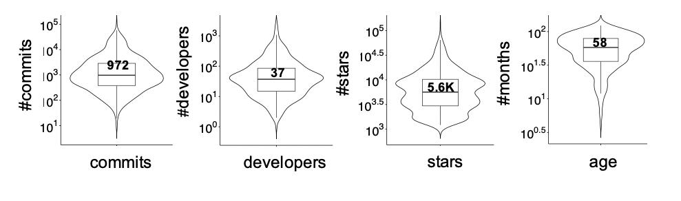

violin plots with the distribution of the number of commits, developers, stars, and age per project

确定了两类要研究的issue label

- labels indicating suitability for new- comers (e.g., newbie
- labels indicating simplicity of tasks (e.g., easy, minor bug/feature, typo)

为了确定issues，前两个作者负责分析标签的内容（共1471541个，7924类标签）（两人的结果基本一致）

稍微有些不相同的比如“help wanted”，把这些不相同的删去

最后得到了113个label 作为适合新手的

并确定了9368个gfi，其中9110个关掉了

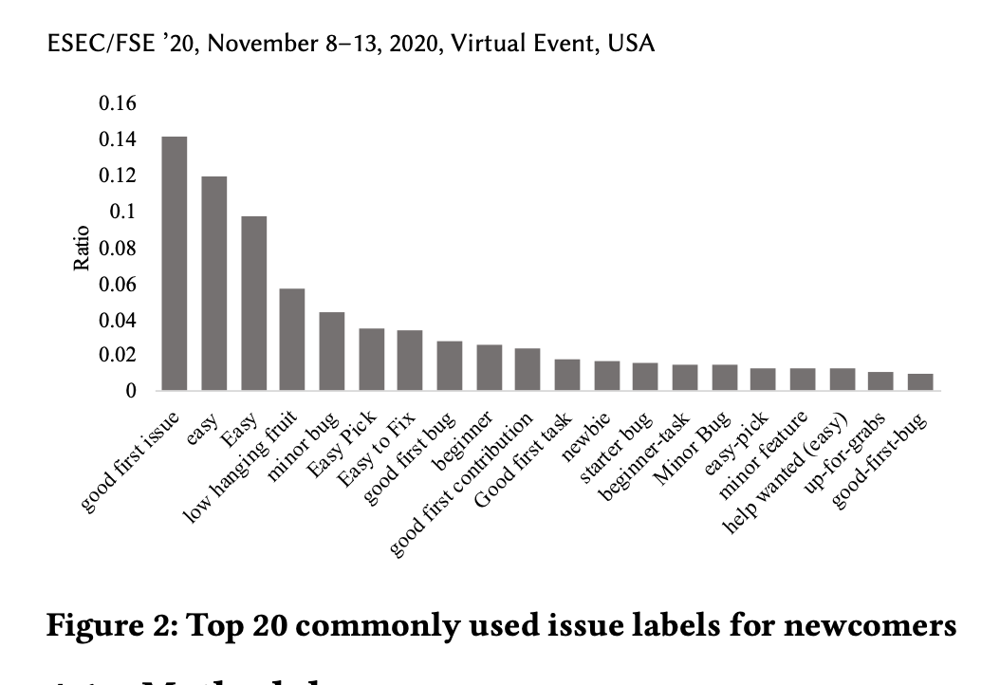

所选标签的比例

## 问题1:How common do projects report GFIs?

为了理解gfi的机制，从三个方面EDA：

- gfi的数量随时间变化图

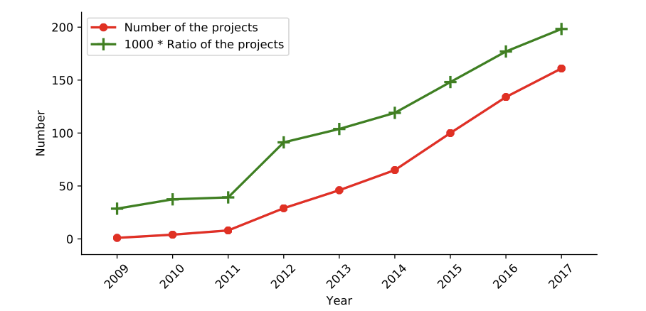

- 项目issue中gfi的分布图

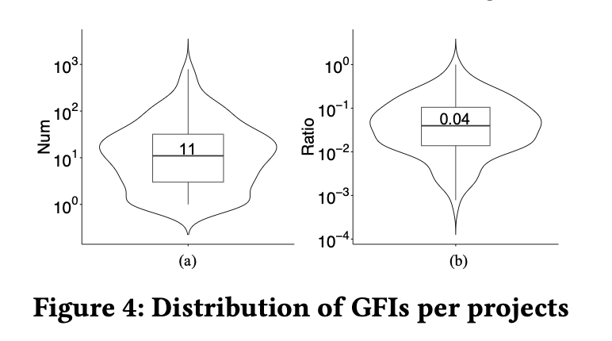

the project scikit-learn re- ported 789 GFIs (41.1% of all the issues), whereas the project savonrb reported only one (0.2%) GFI. However, GFIs are few overall: the median number of GFIs reported by a project is 11 and the median ratio is only 0.04.

- gfi和流行度的关系

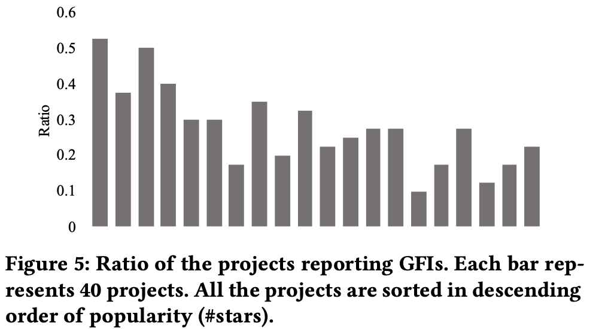

## 问题二：HOW ARE GFIS SOLVED?

分为两部分：

- Analysis of the Resolution Process

  定义了一些指标：

  - \#Days_Resolution：解决消耗的天数
  - \#Actors_Subscription:subscribe的数量
  - \#@mentioned：developer被@的次数（这里developer是指maintainer 还是 newcomer？）
  - \#Times_Reference：commit中提及该issue的次数（没太懂）
  - \#Commenter: developer评论的人数
  - \#Comments:评论数

​		通过秩和检验看gfi和其他issue的关系

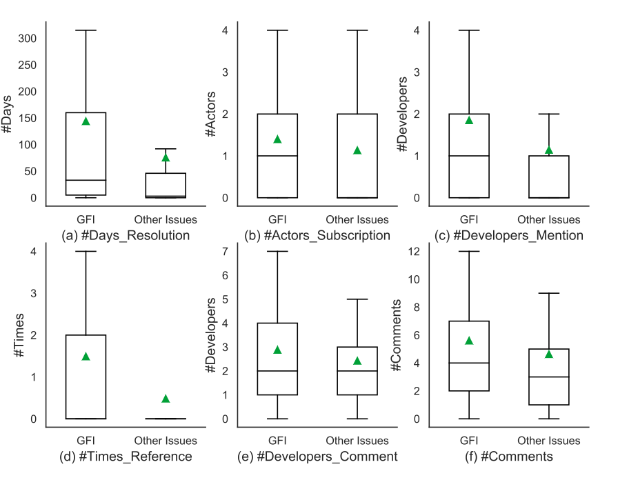

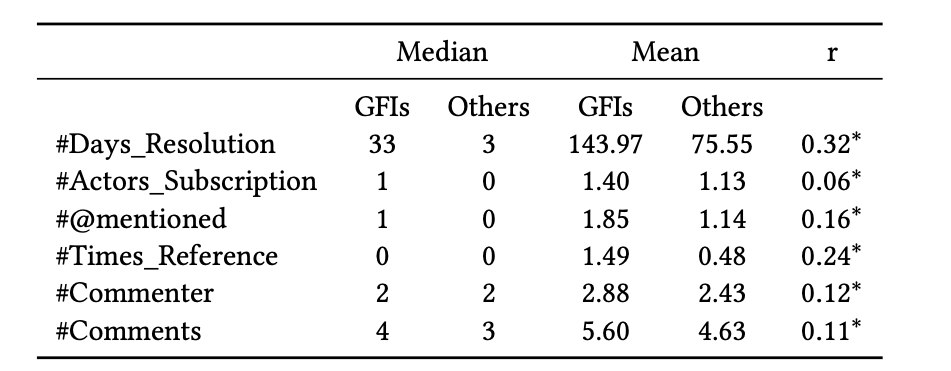

检验结果 整体上是统计学显著的，但是除了 解决的天数这一指标，其他的都是小效应的

- Analysis of the Effect.（多角度分析）

  - GFI角度：有多少事newcomer解决的

    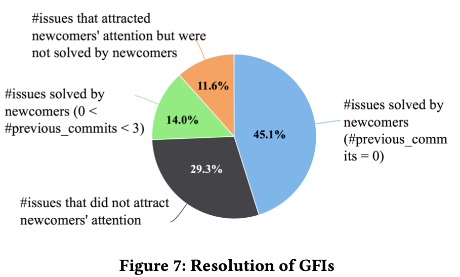

    

  作者又从9110个关闭的issue随机选了200条，剔除了36条不符合的，共164个gfi。对这164个gfi进行逐一分析看看谁成功解决了，谁想解决却失败了，找到了141个newcomer进行分析

  - newcomer角度：有多少人成功的做出贡献了

    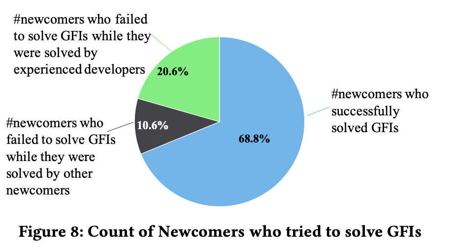

  - 成功参与的newcomer角度：他们会以为解决的gfi而成功的留在项目里吗

    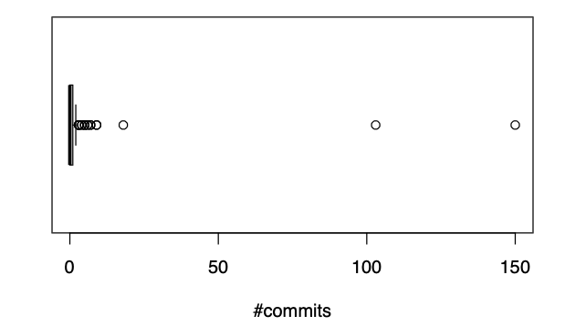

    97个newcomer 中 58%走了，只有三个人超过10commits

  

  

  

## 问题三: WHAT FACTORS AND PROBLEMS ARE RELATED TO THE EFFECTIVENESS OF GFIS?

#### 通过逻辑回归判断

因子：

- Textual Factors（标题长度、description长度、description中url数量、代码片段数量、Readability（Coleman-Liau index）
- 技术因素（新增的代码行、 删除代码行、改变的文件量）
- project popularity （star量）
- Reputation of the Labeler（提这个gfi的人之前的贡献天数以及commits数）

因变量：

为了确定谁解决了gfi，从pr中检索关联到的issue是否是gfi，找到了1429个，其中684个newcomer，745个其他的。

首先先选一下因子防止过拟合 Number of Days Previously Contributed and Number of Commits Previously Contributed.相关性高，选后面那个

#### 结果

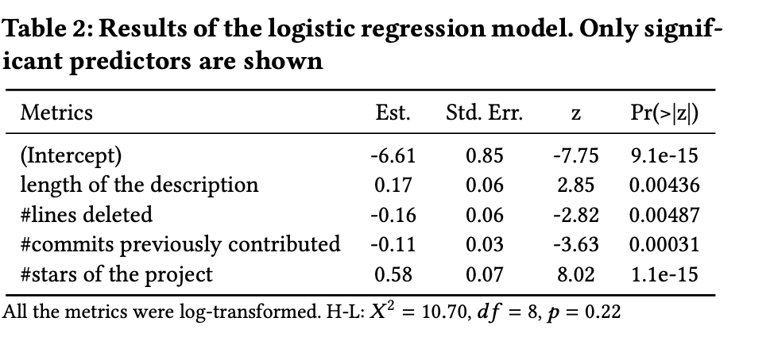

主要的相关因素是项目的流行度、项目maintainer的经验

其中项目的流行度越高，gfi越容易被解决

==maintainer经验越少，gfi越容易被解决==（后面有讲）

gfi的定义不清楚，experts 和novices之间的不匹配

删除的代码量负相关 说明gfi不太适合做删除代码的操作

number of lines added 妹有相关性 因为贡献的种类有很多种

issue的长度越长越好

#### Email Survey

调查对象：44个失败的newcomer，39个maintainer提出的67个gfi没有被解决

- why they failed to solve this GFI. 
- what reasons they thought caused the GFI failed to be solved by newcomers. and the common challenges and problems of this mechanism.

回复率：

- newcomer 20.5%
- Maintainer28.2%

#### 结果：

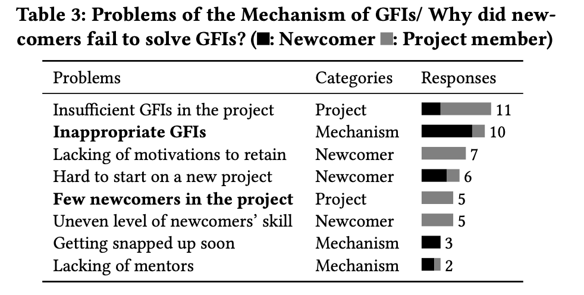

之前的回归只能包含两点，可见在这种和人有关的问题，还是问卷得到的结果比较好

- 2个maintainer说和新人解释清楚很难
- newcomer说有的gfi虽然认领的很快，但是有问题的时候却少帮助
- 有的人只为了简历好看 他们并不为了更深入的工作

## 问题四：HOW TO IDENTIFY APPROPRIATE GFIS?

- Extraction of the Criteria for Identifying GFIs：

  通过email survey确定maintainer设置gfi的标准：选择了最近三个gfi然后问他们：

  - For each of the above issues, why did you think it was suitable for newcomers?
  - In general, what are your standards when judging whether an issue is suitable for newcomers? 

收到了24份

​	结果：

​		Clear Issue Description

​		Self-contained change

​		Limited Skills Needed

​		Less Workload

​		Available Support	

​		Motivating Newcomers

​		Low Urgency

==a good first issue isn’t necessarily an easy issue. In many cases these are actually quite di￿cult. Sometimes the ‘good ￿rst issue’ label is more like an invitation for experts in other subject areas who have knowledge about a related external piece of software to contribute==

​	有一些maintainer表示自己也不知道标准是什么

- Extraction of Key Information in GFI Descriptions.

  nlp的一些方法抽关键词

  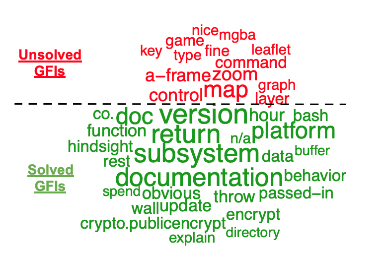

  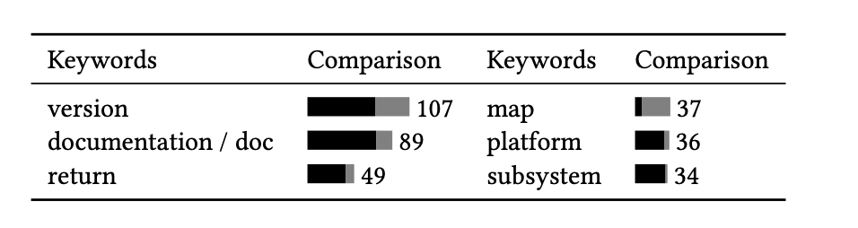

## 帮助

对新人来说：

- 想参与开源可以先参与gfi

对maintainer：

- 设置合理的gfi
- 明确issue分配机制
- 多写文档

**对researcher**：

- 根据description自动分配标签
- 对一些因子深入研究
- 探究experts和novices 的区别

## 结论

Gfi有一堆问题

我们找到了一些方法来解决这个问题（issue description写清楚点）

这些问题可以帮助让gfi问题发挥的更好，从而提升开发者

## 一些小点

### 参与开源项目动机是什么：

- 从需求侧：项目的应用内容与自己使用相关（比如我需要机器人 然后发现功能不全，我来补上）

- 从供给侧：我会一门技术，通过学习的方式巩固这门技术，至于这个做什么无所谓

- 其他

  论文中提到的一篇文章

  J. Feller, B. Fitzgerald, S. A. Hissam, and K. R. huff. 2007. Why Hackers Do What They Do: Understanding Motivation and Effort in Free/Open Source Software Projects. MITP, USA, 3–21. https://ieeexplore.ieee.org/document/6277090