# OpenResearch - OpenList

Curated research papers, articles, and blogs on every aspect about free and open source software (FOSS) ecosystem. 🔎

Table of Contents

# Topics

|No. | Title                                                                                                                                                                                                    | Publication | Year | Rank | Keywords | Clasification{[T](./MindMap/Topic.md), [P](./MindMap/Problem.md), [M](./Opendium/TechView.md)} | Resource | History |
|---|--------------------------------------------------------------------------------------------------------------------------------------------------------------------------------------------------------------|---|---|---|---|---|---|---|
|**0001**| [What Makes a Great Maintainer of Open Source Projects?](https://ieeexplore.ieee.org/abstract/document/9402023) |ICSE|2021|A||T[A0102.开发者]|[[Copy](./PDF/What%20Makes%20a%20Great%20Maintainer%20of%20Open%20Source%20Projects.pdf)], [[Video](https://www.bilibili.com/video/BV1r3411J7YD)], [[Note](https://www.yuque.com/shibudengqinsheng/ggwvkm/gx84ci)], [[Note2](https://www.yuque.com/shibudengqinsheng/ggwvkm/eri2s3)], [~~Slide~~]||
|0002| How Do Companies Collaborate in Open Source Ecosystems? An Empirical Study of OpenStack       |ICSE|2020|A||T[A0203.企业], T[D.社区与生态]|[[Copy](./PDF/How_Do_Companies_Collaborate_in_Open_Source_Ecosystems_An_Empirical_Study_of_OpenStack.pdf)]||
|**0003**| [Sustainability Forecasting for Apache Incubator Projects](https://dl.acm.org/doi/abs/10.1145/3468264.3468563)   |FSE|2021|A||T[D0401.Sustainability]|[[Copy](./PDF/Sustainability%20Forecasting%20for%20Apache%20Incubator%20Projects.pdf)], [[Video](https://www.bilibili.com/video/BV143411s7YS)], [Note], [Slide]||
|0004| Let's Talk About It: Evaluating Contributions through Discussion in GitHub              |FSE|2014|A||T[C0501.Contributions]|[[Copy](./PDF/Let's%20Talk%20About%20It-%20Evaluating%20Contributions%20through%20Discussion%20in%20GitHub.pdf)]||
|0005| **Companies' Participation** in OSS  Development-An Empirical Study of OpenStack                                                                                                                             |TSE|2021|A||T[A0203.企业], T[D.社区与生态]|||
|0006| **World of  code**: enabling a research workflow for mining and  analyzing the universe of open source VCS data                                                                                              |ESE|2021|A||T[E0105.VCS], P[B02.数据集构建]|||
|0007| Profiles of **Schema  Evolution** in Free Open Source Software Projects                                                                                                                                      |ICDE|2021|A||T[D06.演化]|||
|0008| CENTRIS: A precise and  scalable approach for identifying modified **open-source  software reuse**                                                                                                           |ICSE|2021|A||T[B0101.Code Reuse]|||
|0009| Understanding **Community Smells** Variability: A  Statistical Approach                                                                                                                                      |ICSE|2021|A||T[D0206.Community Smells]|||
|0010| Representation  of **Developer Expertise** in  Open Source Software                                                                                                                                          |ICSE|2021|A||T[A0102.开发者/Developer Expertise]|||
|0011| Enterprise-Driven  Open Source Software: A Case Study on **Security Automation**                                                                                                                             |ICSE|2021|A||T[C0801.CI]|||
|**0012**| [The **Shifting** Sands of **Motivation**: Revisiting What Drives Contributors in Open Source](https://ieeexplore.ieee.org/abstract/document/9402044) |ICSE|2021|A||T[A0102.开发者/Motivation Changes]|[Copy], [[Video](https://www.bilibili.com/video/BV14U4y1c7TE?p=2)], [Note], [[Slide](https://xlab2017.yuque.com/staff-kbz9wp/dtv0fr/26097982)]||
|0013| **Secure  software development** in the era of fluid multi-party open software and  services                                                                                                                 |ICSE-NIER|2021|A||T[C08.开发过程]|||
|0014| A Large Scale Study of **Long-Time Contributor** Prediction  for GitHub Projects                                                                                                                             |TSE|2021|A||T[A0102.开发者/Developer Role Evolution]|||
|0015| Open source ecosystems need  equitable **credit** across  contributions                                                                                                                                      |Nature  Computational Science|2021|A||T[C0501.Contributions]|||
|0016| Enhancing developers’ support  on pull requests activities with software **bots**                                                                                                                            |ESEC/FSE 2020|2020|A||T[A0301.Software Bots]|||
|0017| A **theory  of the engagement** in open source projects via  summer of code programs                                                                                                                         |ESEC/FSE 2020|2020|A||T[A0102.开发者]|||
|**0018**| [A first look at **good first issues** on GitHub](https://dl.acm.org/doi/abs/10.1145/3368089.3409746) |ESEC/FSE 2020|2020|A||T[C10.Issue]|[Copy], [[Video](https://www.bilibili.com/video/BV1DF411W78t)], [[Note](./Records/T18.md)], [~~Slide~~]||
|0019| **Scaling  open source communities**: An empirical study of  the linux kernel                                                                                                                                |ICSE|2020|A||T[D0602.Evolution of Communities of Software]|||
|0020| Managing  **Episodic Volunteers** in  Free/Libre/Open Source Software Communities                                                                                                                            |TSE|2020|A||T[C0507.Govern Developers]|||
|0021| Modeling  and Recommending **Open Source Licenses** with findOSSLicense                                                                                                                                      |TSE|2019|A||T[F0404.许可证推荐]|||
|0022| On the Impact of **Security Vulnerabilities** in the npm  and RubyGems Dependency Networks                                                                                                                   |arXiv|2021|A?||T[B0503.Vulnerable Dependencies]|||
|0023| Development of **recommendation systems** for software  engineering: the CROSSMINER experience                                                                                                               |ESE|2021|B||T[C0306.推荐/API Recommendation]|||
|0024| Continuous **software  bug prediction**                                                                                                                                                                      |ESEM|2021|B||T[C1304.Bug Detection]|||
|0025| Repo2vec: A comprehensive  embedding approach for determining **repository similarity**                                                                                                                      |ICSME|2021|B||T[C0301.Similarity of GitHub Repositories]|||
|0026| ALBFL: A novel neural ranking model for **software  fault localization** via combining static and dynamic features                                                                                           |IST|2021|B||T[B0501.Automated Fault Localization]|||
|0027| A systematic mapping study of **developer social network** research                                                                                                                                          |JSS|2021|B||T[E03.Developer Social Network(DSN)]|||
|0028| **Open Data  Ecosystems**—An empirical investigation into an  emerging industry collaboration concept                                                                                                        |JSS|2021|B||T[F0103.Open Data Ecosystem]|||
|0029| A **complex  network analysis** of the **Comprehensive R Archive  Network (CRAN)** package ecosystem                                                                                                         |JSS|2021|B||T[C1907.基于复杂网络方法的度量], T[E0108.Comprehensive R Archive Network (CRAN) Package Ecosystem]|||
|0030| Empirical  analysis of security **vulnerabilities** in python packages                                                                                                                                       |SANER|2021|B||T[B0503.Vulnerable Dependencies]|||
|0031| Is this GitHub project **maintained**? Measuring the level of  **maintenance activity** of open-source projects                                                                                              |IST|2020|B||T[C0701. Project Life-span], T[E0203.Activity-Based Analysis]|||
|0032| Exploring **software  bug-proneness** based on **evolutionary clique** modeling and analysis                                                                                                                 |IST|2020|B||T[C13.Bug], T[E06.Evolutionary Coupling]|||
|0033| Pull Requests or Commits?  Which Method Should We Use to Study **Contributors'  Behavior**?                                                                                                                  |SANER|2020|B||T[C0501.Contributions], T[C1901.活跃度]|||
|0034| **Open  source software ecosystems**: A Systematic mapping                                                                                                                                                   |IST|2017|B||T[F0102.OSS Ecosystem]|||
|0035| **Developer  Role Evolution** in Open Source Software Ecosystem:  An Explanatory Study on GNOME                                                                                                              |JCST|2017|B||T[A0102.开发者/Developer Role Evolution]|||
|0036| **Motivating  the contributions**: An Open  Innovation perspective on what to share as Open  Source Software                                                                                                 |JSS|2018|B||T[A0102.开发者/Motivating the Contributions]|||
|0037| **开源社区评审过程度量体系**及其实证研究                                                                                                                                                                                       |软件学报|2021|A||T[C0803.Code Review]|||
|0038| GitHub  中软件生态系统的**演化**                                                                                                                                                                                       |计算机研究与发展|2020|A||T[D0603.Evolution of Software Ecosystem]|||
|0039| 软件生态系统研究**综述**                                                                                                                                                                                               |计算机学报|2020|A||T[F0102.OSS Ecosystem]|||
|**0040**| [基于贡献分配的开源软件**核心开发者**评估](http://www.jos.org.cn/jos/article/abstract/5521)                                                                                                                                    |软件学报|2018|A||T[A0102.开发者], T[C1904.开发者贡献度]|[[Copy](http://www.jos.org.cn/jos/article/pdf/5521)], [[Video](https://www.bilibili.com/video/BV1f541127Vt)], [[Note](https://www.yuque.com/tyn1998/blogs/cs1unx)], [[Slide](https://tyn1998.github.io/2022/04/05/slides-Xlab%E8%AE%BA%E6%96%87%E5%88%86%E4%BA%AB_%E5%9F%BA%E4%BA%8E%E8%B4%A1%E7%8C%AE%E5%88%86%E9%85%8D%E7%9A%84%E5%BC%80%E6%BA%90%E8%BD%AF%E4%BB%B6%E6%A0%B8%E5%BF%83%E5%BC%80%E5%8F%91%E8%80%85)]||
|0041| 开源项目活跃度模型构建及实证 |信息技术与网络安全|2021|-||T[C1901.活跃度]|[[Copy](./PDF/开源项目活跃度模型构建及实证_杨欣捷.pdf)]|[#1](PaperRecomm/SpecialReason.md)|
|0042| Studying Software Developer Expertise and Contributions in Stack Overflow and GitHub |ICSME|2020|B|Software developer expertise, developer contributions||[[Copy](https://xlab2017.yuque.com/msdpvs/dtg7ew/26098657)]|[[RecIssue](https://github.com/X-lab2017/open-research/issues/44)]|

Notes: A bold `No.` indicates the record has been shared in our meetings, e.g. **`0012`**.

---

# A. 论文收集流程图

```mermaid
flowchart TD
	start(开始)
    op1[推送PR]
    cond_a{推送文献有标签?}
    cond_b{标签在已有体系内?}
    cond_c1{文献为近5年且Rank B及以上?}
    op2[提交详细理由]
    cond_c2{详细理由review通过?}
    cond_d{有资源链接?}
    op3[merge PR]
    exit(结束)

    op_e1[添加标签重提PR]
    op_e2__op_1[提PullRequest修改标签体系]
    cond_e2__cond_a{审核PR通过?}
    op_e2__op_2[修改标签重提PR]
    op_e3[修改理由重提PR]
    cond_e4__cond_a{提上传相关资源的TODO issue?}
    cond_e4__cond_b{PR_Comment注明暂无资源?}


    start --> op1 --> cond_a --yes--> cond_b --yes--> cond_c1 --yes--> cond_d --yes--> op3 --> exit
    
    cond_a --no--> op_e1 --> op1
    cond_b --no--> op_e2__op_1 --> cond_e2__cond_a
    cond_e2__cond_a --yes--> cond_c1
    cond_e2__cond_a --no--> op_e2__op_2 --> op1
    cond_c1 --no--> op2 --> cond_c2
    cond_c2 --yes--> cond_d
    cond_c2 --no--> op_e3 --> op1
    cond_d --no--> cond_e4__cond_a
    cond_e4__cond_a --yes--> op3
    cond_e4__cond_a --no--> cond_e4__cond_b
    cond_e4__cond_b --yes--> op3
    cond_e4__cond_b --no--> op1
   
```

# B. Directory Tree
A **[sample map](https://www.mubucm.com/doc/58RDuDR3QJG#m)** divided by topics: [Edit Link](https://mubu.com/colla/5nyxE2inO3W).

